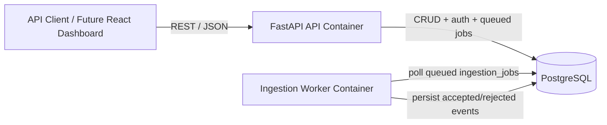

# vehicle-telemetry-api

Production-grade FastAPI backend for vehicle telemetry ingestion, querying, and event processing.

## Goal

Design and implement a production-grade telemetry backend similar to what might exist inside an OEM or Tier-1 supplier.

## Stack

FastAPI · PostgreSQL · Docker · Alembic · Pytest

## Architecture



The API process handles request validation, JWT/RBAC, and synchronous reads/writes. Background ingestion is handled by a separate worker container that polls persisted `ingestion_jobs`, so queued work survives API restarts and does not depend on in-process memory.

## Status

Phase 1 — core telemetry API

Implemented:

- Health and database health checks
- Vehicle create, get, update, delete, filtered search, and paginated list endpoints
- ECU create, get, update, delete, and paginated vehicle-scoped list endpoints
- Signal create, get, update, delete, and vehicle-scoped list endpoints
- Event ingestion, batch ingestion, detail lookup, vehicle-scoped querying, and filtering by ECU, event type, and created-at range
- Structured JSON telemetry payloads backed by PostgreSQL JSONB
- Background event ingestion with persisted ingestion job status
- Separate worker container/process for queued ingestion jobs
- Vehicle telemetry summary with ECU count, event count, latest event timestamp, and event counts by type
- Consistent JSON error responses
- JWT authentication with `admin`, `engineer`, and `viewer` roles
- CORS configuration for local React dashboard origins
- SQLAlchemy models, repository/service layering, and Alembic migrations for telemetry tables, constraints, and indexes

## Local Development

Copy `.env.example` to `.env`, then start the API and database:

```bash
docker compose up --build
```

Or use:

```bash
make up
```

Run migrations inside the API container:

```bash
docker compose exec api alembic upgrade head
```

Or:

```bash
make migrate
```

Load demo seed data:

```bash
make seed
```

Run tests:

```bash
docker compose exec api pytest -q
```

Or:

```bash
make test
```

Coverage is enforced at 70% minimum.

Run the opt-in PostgreSQL integration test marker inside Docker:

```bash
make test-postgres
```

PostgreSQL is published on `localhost:5433` to avoid collisions with a local Postgres install. Containers still talk to it internally as `db:5432`.

## API Examples

Create a vehicle:

```bash
curl -X POST http://localhost:8000/api/v1/vehicles \
  -H "Content-Type: application/json" \
  -d '{"vin":"1FTFW1RG0PFA12345","make":"Ford","model":"F-150","year":2024}'
```

Create an event with a structured telemetry payload:

```bash
curl -X POST http://localhost:8000/api/v1/events \
  -H "Content-Type: application/json" \
  -d '{"vehicle_id":1,"ecu_id":null,"event_type":"DTC","payload":{"code":"P0300","severity":"warning","odometer_miles":42108}}'
```

Batch ingest events:

```bash
curl -X POST http://localhost:8000/api/v1/events/batch \
  -H "Content-Type: application/json" \
  -d '{"events":[{"vehicle_id":1,"ecu_id":null,"event_type":"INFO","payload":{"message":"boot"}},{"vehicle_id":1,"ecu_id":null,"event_type":"DTC","payload":{"code":"U0100"}}]}'
```

Queue background event ingestion:

```bash
curl -X POST http://localhost:8000/api/v1/ingestion/events \
  -H "Content-Type: application/json" \
  -d '{"events":[{"vehicle_id":1,"ecu_id":null,"signal_id":null,"event_type":"INFO","payload":{"message":"boot"}}]}'
```

Check an ingestion job:

```bash
curl http://localhost:8000/api/v1/ingestion/jobs/1
```

Create a signal:

```bash
curl -X POST http://localhost:8000/api/v1/signals \
  -H "Content-Type: application/json" \
  -d '{"vehicle_id":1,"ecu_id":1,"name":"engine_rpm","unit":"rpm","data_type":"integer","description":"Engine speed"}'
```

Filter vehicles:

```bash
curl "http://localhost:8000/api/v1/vehicles?make=Ford&model=F-150&year=2024&vin_prefix=1FT"
```

View telemetry summary:

```bash
curl http://localhost:8000/api/v1/vehicles/1/telemetry/summary
```

## JWT Auth And Roles

Set `AUTH_ENABLED=true` and a strong `JWT_SECRET_KEY` in `.env` to require bearer tokens on vehicle, ECU, signal, event, ingestion, and user endpoints:

```bash
AUTH_ENABLED=true
JWT_SECRET_KEY=replace-with-a-long-random-secret
```

Bootstrap the first admin user:

```bash
curl -X POST http://localhost:8000/api/v1/auth/bootstrap \
  -H "Content-Type: application/json" \
  -d '{"username":"admin","password":"password123","role":"admin"}'
```

Log in:

```bash
curl -X POST http://localhost:8000/api/v1/auth/login \
  -H "Content-Type: application/json" \
  -d '{"username":"admin","password":"password123"}'
```

Use the returned token:

```bash
curl http://localhost:8000/api/v1/vehicles \
  -H "Authorization: Bearer <token>"
```

Roles:

- `admin`: full access, including deletes and user creation
- `engineer`: create/update ingestion resources, no deletes or user admin
- `viewer`: read-only access

## Design Decisions

- **Layered backend:** routes delegate to services, and services delegate persistence to repositories so HTTP concerns do not leak into database code.
- **DB-backed ingestion queue:** ingestion jobs are persisted in PostgreSQL rather than held in process memory, making work visible and restart-tolerant without adding Redis or a broker yet.
- **JSONB payloads:** telemetry events carry flexible structured payloads while core entities remain relational for filtering, ownership, and joins.
- **JWT/RBAC with disabled-by-default local auth:** `AUTH_ENABLED=false` keeps local demos frictionless; enabling auth exercises the same role checks intended for production.
- **Docker-first workflow:** Compose starts API, worker, and Postgres together; Make targets wrap the common run, migrate, seed, and test commands.

## Future Improvements

- Move the ingestion queue to Redis/Celery or a managed queue when throughput requires horizontal worker scaling.
- Add metrics endpoints and request/job latency instrumentation.
- Add richer seed scenarios and demo scripts for interview walkthroughs.
- Add the React fleet dashboard against the existing versioned API and CORS config.
